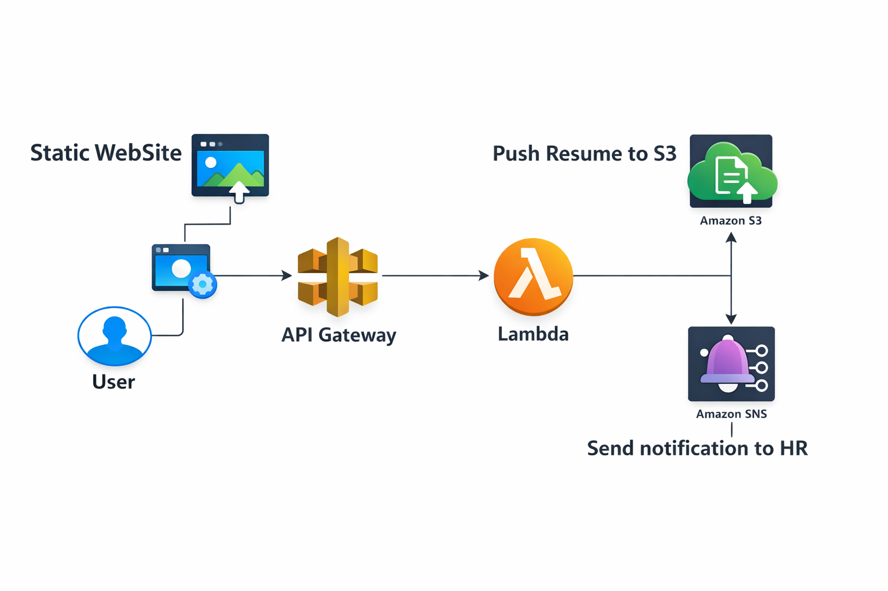
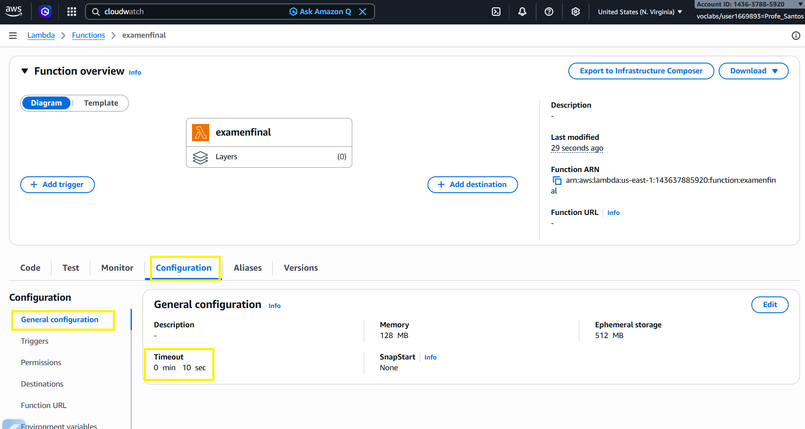
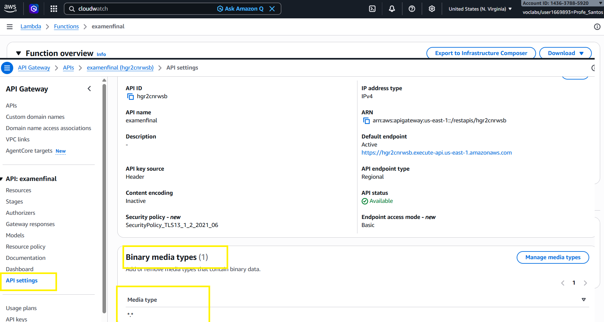

# Examen Arquitecturas Cloud y DevOps

Carpeta Backend y Frontend
Fichero docker-compose.yaml


# Examen Despliegues Web

Carpeta Serverless
## Arquitectura

## LAMBDA. Cambios en tiempo de ejecución Lambda. Cambiar 3 a 10 segundos

## API GW. Cambios para aceptar enviar ficheros binarios. Agregar ```*.*```



